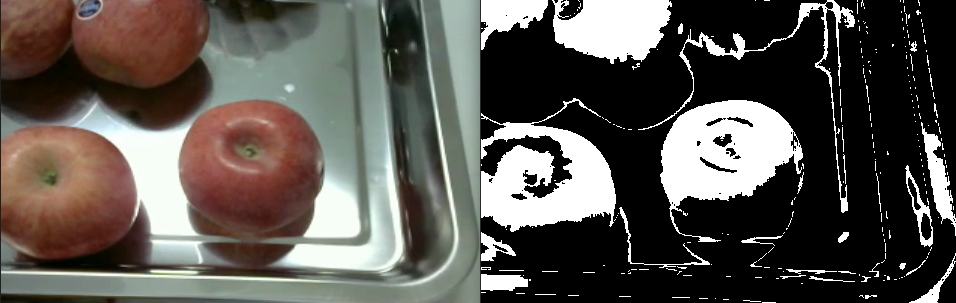
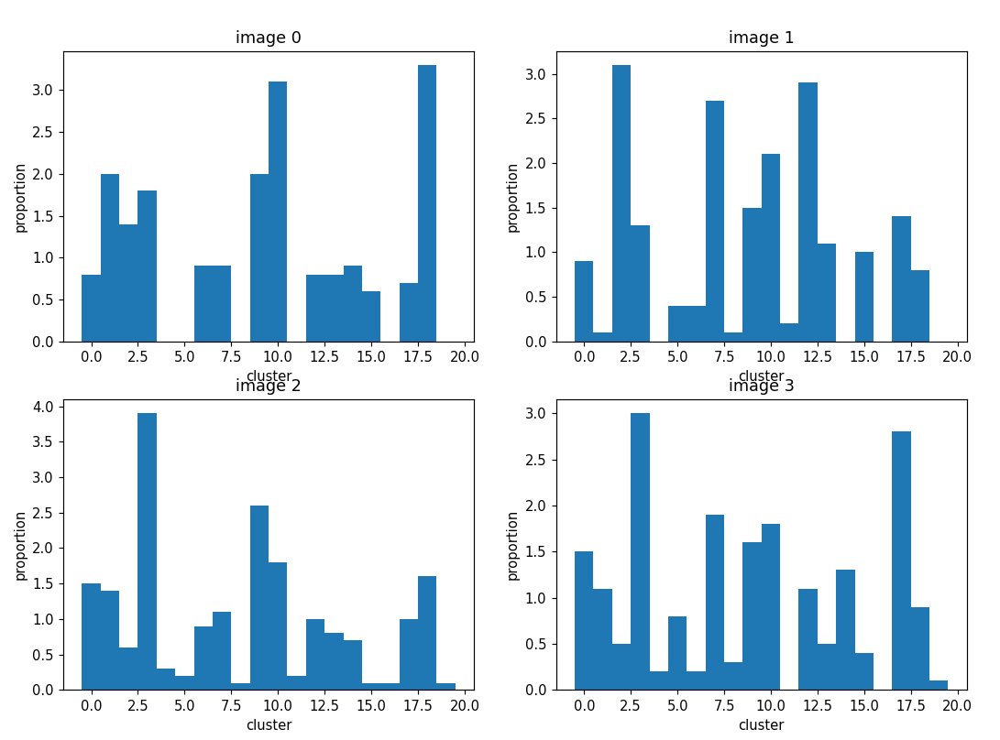

# Bag-of-Words-Computer-Vision - a keypoints-based image classification pipeline with classic Computer Vision techniques

Computer Vision project for image classification pipeline using keypoints detection.

## Description

The project follow the [bag-of-words](https://en.wikipedia.org/wiki/Bag-of-words_model_in_computer_vision) approach to image clasification.

The pipeline can be described as follows:

- 1) Apply a segmentation algorithm on all images to extract regions of interest

- 2) Apply a keypoints detection algorithm such as SIFT or SURF on images and select the keypoints in regions of interest

- 3) Apply a clustering algorithm on each keypoint descriptors of each class to extract a vocabulary of descriptors

- 4) Apply a histogram-of-words algorithm on each image to get features vectors

- 5) Apply a classifier like SVM or Gradient Boosting to classify each images

## Example on fruits dataset

The fruits dataset is available on the repository (loaded with Git LFS). The dataset provided is only a small part of the [original dataset](https://www.kaggle.com/chrisfilo/fruit-recognition) containing only images of size (322, 488), 3 kinds of red apples and tomatoes.

A simple segmentation using RGB thresholding is first applied to the images to get the mask of apple and tomatoes:

Then, the SIFT keypoints detection is applied on the gray-scale images and only the keypoints in the mask or kept:

Then, the descriptors are extracted from the keypoints and clustered to get the vocabulary for each class.

After that, we can compute a vector of features for each image using SIFT descriptors and the vocabulary. For example with 4 images of apples we get the following histograms in a simple case were the vocabulary is composed of 20 words:

Finally, a SVM is apply to classify the images correctly using the features vectors.
